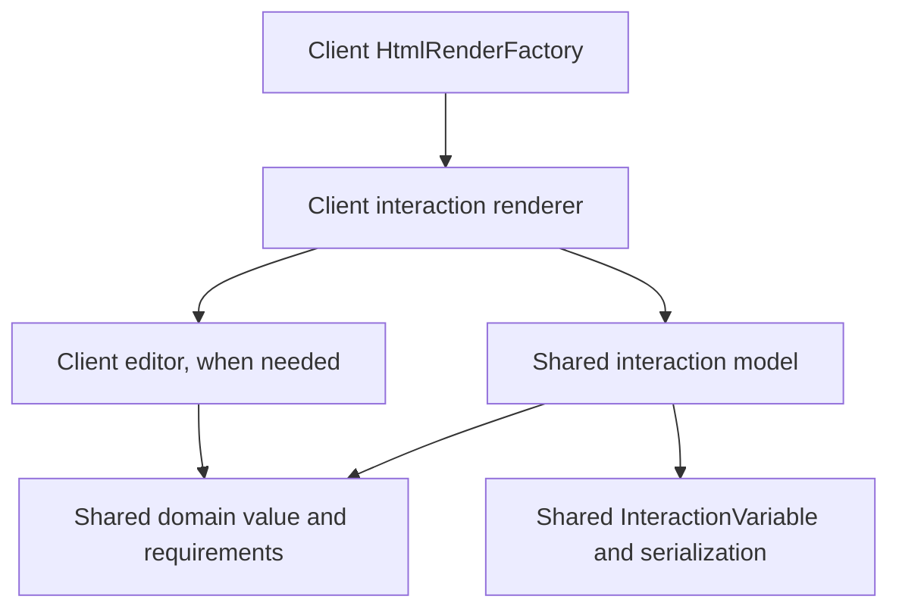

# Interaction models, renderers and editors

An interaction describes an exercise and its saved value. Its renderer connects that model to the workbook UI. An optional editor provides the controls for changing the value. The shared model is usable without a browser; renderers and editors belong to the client module.

The current trait is named **`WorkbookInteractionElement[T]`**, defined in [WorkbookElement.scala](../modules/core/shared/src/main/scala/it/evadid/workbook/abstractions/WorkbookElement.scala). “WorkbookInteraction” refers to this concept; there is no separate trait with that shorter name in the current source.

## Responsibilities and dependencies

| Component | Location | Owns | Depends on |
| --- | --- | --- | --- |
| Domain value `T` | `modules/core/shared` | Exercise data, algorithms, validation and value codecs | Shared model/utilities |
| Interaction model | `modules/core/shared` | Stable element ID, exercise configuration/requirements, default value, factory, value serializer and `InteractionVariable[T]` | Domain value and shared workbook infrastructure |
| Renderer | `modules/client` | Workbook preview/card, state binding, labels, editor construction and fullscreen opening | Interaction model, client controls, Laminar and optional editor |
| Editor | `modules/client` | Editing controls, draft/selection state, event handling and fullscreen lifecycle | Domain types, supplied bound state/configuration and browser UI infrastructure |

The source dependency direction is:



Shared interaction/domain code must not import client renderers, Laminar, DOM types or fullscreen controls. Editors can accept domain requirements and callbacks without depending on the entire workbook interaction. The QR and mail editors receive a bound `Var` and configuration; they do not look up their interaction or construct a second persistence store.

An editor is optional. A checkbox or text interaction can render its controls directly in the workbook line. A fullscreen editor is useful when the editing interface needs more space or has its own lifecycle. The renderer remains responsible for placing that interface within the workbook experience.

## Model serialization and learner state

There are two distinct serialization concerns:

- `associatedFactory` serializes the **exercise definition**: element ID, configuration, initial value and requirements. A `WorkbookElementFactory` belongs to the shared model layer.
- `serializerInteractionContent` serializes the **learner value `T`**. `InteractionVariable[T]` owns the value history and uses this serializer for persistence/synchronization.

`defaultValue` initializes the history; it is not a second live copy of the learner's answer. The current answer is `interactionVariable.currentValue`. Grading belongs to the shared domain/interaction API where possible; renderers display its result. Completion APIs are currently interaction-specific (`isPassed`, requirement evaluators, sorting results), rather than a universal grading contract on the base trait.

## Rendering and editing flow

1. A workbook factory composes interaction models into exercise containers and sections.
2. [HtmlRenderFactory.scala](../modules/client/src/main/scala/it/evadid/homepage/workbook/htmlRenderer/HtmlRenderFactory.scala) dispatches each model to its registered renderer. `LineBasedRenderingFactory` produces an `AtomarLineRendering`, wrapped with the model in `HtmlWorkbookElement`.
3. The renderer binds the interaction's value through the existing synchronization control:

   ```scala
   import it.evadid.core.datastructures.state.StateHelper.StateBasedVar
   import it.evadid.workbook.interaction.sync.UpdateImportance

   val state = element.interactionVariable
     .createBoundStateWithUpdateImportance(fullInfo.syncControl, UpdateImportance.MAJOR)
     .toAirstreamVar
   ```

4. The preview observes `state.signal`. Opening the editor passes this same bound state, together with exercise configuration, to the editor. The renderer asks `fullInfo.displayControl.setFullscreen(...)` to display it; the editor implements `HtmlAppElement` and, when necessary, `FullscreenLifecycle`.
5. Editor updates flow through the bound state into `InteractionVariable` history and `SyncControl.requestStore`. Restored/synchronized values flow back through the binding to the preview and editor. The editor should reconcile its local controls with those updates.

The binding is implemented in [InteractionVariable.scala](../modules/core/shared/src/main/scala/it/evadid/workbook/interaction/variable/InteractionVariable.scala). Editors should update the supplied state rather than bypassing it with direct local-storage writes.

Drafts, selection and validation messages are usually editor-local state. They become saved domain state only when an accepted edit updates the bound value. QR's invalid text draft preserves the last valid saved symbol; mail's unsent draft is discarded on close. Save timing and close behavior are exercise-specific and should be documented and tested.

## Concrete examples

| Layer | QR creation | Email sorting |
| --- | --- | --- |
| Domain value | `QrCode` with resolved configuration; `QrCodeRequirements` evaluates it | `InboxStateScaffolding` contains the mailbox; `InboxState.sortingResult` evaluates placement |
| Interaction | `CreateQrCodeInteraction` owns requirements and an initial code | `MailInteraction` owns initial inbox, account and `allowCompose` |
| Renderer | `CreateQrCodeInteractionRenderer` shows saved symbol/feedback and opens the editor | `HtmlMailInteractionRenderer` shows folder counts/progress and opens the editor |
| Editor | `QrCodeEditor(Var[QrCode], requirements)` | Client `MailEditor(Var[InboxStateScaffolding], account, allowCompose)` |

Read the [QR renderer](../modules/client/src/main/scala/it/evadid/homepage/workbook/htmlRenderer/interactionRenderer/qr/CreateQrCodeInteractionRenderer.scala) and [mail renderer](../modules/client/src/main/scala/it/evadid/homepage/workbook/htmlRenderer/interactionRenderer/emailSimulator/HtmlMailInteractionRenderer.scala) for the complete preview/fullscreen pattern.

**Mail naming:** there is also a shared interaction model called `MailEditor` for writing practice, distinct from the client UI editor with the same name. `HtmlMailEditorRenderer` renders that model and reuses the same client editor. The mail sorting renderer aliases the client class as `Editor` to avoid ambiguity. The name “Editor” alone does not determine which layer a class belongs to; its package and base type do.

## Turtle shape recreation

[TurtleRecreateShapeInteraction](../modules/core/shared/src/main/scala/it/evadid/workbook/elements/interactionElements/programming/programmingExerciseTurtle/TurtleRecreateShapeInteraction.scala) is a `WorkbookInteractionElementWithGrader[ProgrammingState, RecreateShapeGradingResult]`. The learner's saved value is the program, rather than the resulting drawing. The exercise definition supplies `initProgram`, a target `TurtleGraphic` in `desiredResult`, `availablePalette` and `limitTurtleCommandUsage`. The interaction uses the shared `ProgrammingState` uPickle codec for learner values; its definition factory handles the exercise configuration separately.

[HtmlTurtleRecreateShapeRenderer](../modules/client/src/main/scala/it/evadid/homepage/workbook/htmlRenderer/interactionRenderer/turtleStitch/HtmlTurtleRecreateShapeRenderer.scala) creates one bound `Var[ProgrammingState]` and uses it for three workbook cards: the open-editor button, a `SnapPreviewEditor` program preview, and the interactive turtle drawing comparison. It maps `availablePalette` to `SnapCodeEditorConfig`, then creates `EvaEditorConfig` and `EvaEditorTurtle` with that same state and target. Unlike the QR/mail renderers, it constructs and retains the editor when rendering the interaction, rather than constructing a fresh editor on each open.

[EvaEditorTurtle](../modules/client/src/main/scala/it/evadid/homepage/webElements/editor/code/EvaEditor/EvaEditorTurtle.scala) extends `EvaEditor`, which manages the configured language tabs and editor lifecycle. Its sidebar displays the same target comparison as the workbook preview. Both derive commands through `state.signal.map(_.toBeExpressionState.deriveTurtleCommands)` and pass them with the target to `TurtleJsxGraphRenderer`. Editing the program therefore updates both views through the shared binding; this preview uses synchronous shared-model derivation, not the separate Pyodide execution service.

There is an existing client-level coupling here: `EvaEditorTurtle` calls `HtmlTurtleRecreateShapeRenderer.createInteractivePreview` to reuse the comparison UI. Thus this particular editor depends on its renderer as well as the renderer depending on the editor. Shared core remains independent of both. A future extraction could place the comparison component in a separate client view helper, as QR does with `QrCodeView`.

The interaction stores command-usage limits, but this renderer does not pass them into the editor or enforce them. It also does not expose a model-level `isPassed` method. The visual comparison should not be described as a complete requirements/grading implementation merely because its label contains “grading”.

## Choice questions and a threshold-neuron exercise

`ChoiceInteraction` stores `ChoiceAnswer` in shared core and is rendered inline by `ChoiceInteractionRenderer`; it needs no fullscreen editor. Optional expected selections distinguish knowledge checks from ungraded opinions.

`ThresholdNeuronInteraction` stores shared `NeuronParameters`, binary examples and input labels. `ThresholdNeuronRenderer` creates a bound state and preview card, then opens `ThresholdNeuronEditor` with that state and the exercise's examples/initial parameters. `NeuronEditorState` keeps incomplete numeric drafts local while valid edits flow to the saved value. See the [PDF/ZIP migration inventory](digital-workbook-migration.md) for the source activity and verification commands.

## Adding an interaction

Define the domain value and requirements in shared core, then add the interaction model and its definition factory/content serializer. Register the factory in the shared factory registry and the renderer in `HtmlRenderFactory`. Build an editor only when the controls warrant a separate component. Keep CSS in dedicated files, reuse shared color/dimension tokens, and ensure workbook entry pages load the required styles.

Test domain transitions, validation/grading and both serialization boundaries in core JVM/JS. Test editor-local state and bindings in client tests. Browser checks should cover the actual preview/fullscreen flow, reopening/restoration, invalid drafts and layout where relevant. See the [email simulator guide](email-simulator.md) and [QR guide](qr-code-interaction.md) for existing suites and commands.

## Inline answer tables

`AnswerTableInteraction` belongs to shared core and describes row/column labels and fixed or editable cells. Its `TableAnswer` value contains only editable strings in row-major order; fixed cells are exercise content, not learner state. The model validates dimensions and choices, checks completion, and counts only cells with expected answers. Text alternatives compare case-sensitively after trimming; ungraded reflection cells never contribute to that count.

`AnswerTableRenderer` in client binds the interaction variable to text inputs or selects. It displays localized headings and feedback, while `digital-workbooks.css` owns presentation and horizontal scrolling. It requires no editor or fullscreen lifecycle. The image-recognition chapter combines this inline interaction with the separate threshold-neuron interaction and fullscreen editor; they keep independent learner values.

The Blockchain balance exercise also reuses this interaction and renderer. `TeachingLedger` is a pure shared-core calculation model: it applies ordered integer-point transfers and validates available funds. The workbook factory uses its result to author expected table cells; persisted learner state is still `TableAnswer`, not the ledger. A domain calculation does not need a new interaction or editor when the existing answer table already expresses the task. Signature and privacy research use ungraded cells and separate text inputs.

## Binary pixel canvases

`BinaryPixelImage` in shared core owns validated dimensions, row-major bits, indexing and immutable toggles. `BinaryPixelInteraction` uses it as the learner value; targets, presets and `PixelThresholdProbe` definitions remain exercise configuration. Its bound serializer rejects saved images of the wrong shape, and grading compares all pixels when a target exists. Without a target, exploration remains ungraded.

`BinaryPixelRenderer` presents a small inline canvas with accessible toggle buttons, a read-only target when configured, reset/preset controls and detector feedback. It binds the interaction variable directly and needs no separate fullscreen editor. CSS owns sizes, colors, wrapping and focus indicators. The image-recognition chapter uses this component for the source's 3×5 digit patterns and two fixed row detectors; it does not implement network training.

## Square-middle hash exercises

`SquareMiddleHash` in shared core performs the worksheet's exact decimal `BigInt` calculation. `SquareMiddleHashInteraction` defines an exploration, collision or preimage task and stores `SquareMiddleHashAnswer` input strings. Invalid numeric strings are persisted drafts, not computed domain results; the parser returns no calculation for them. Collision grading compares numeric inputs and exact two-digit hashes, so zero-prefixed spellings of the same number are not collisions.

`SquareMiddleHashRenderer` binds text controls directly to that learner value, renders calculated squares with semantic `mark` elements, and displays model grading. It is inline and needs no fullscreen editor. All visual rules belong to dedicated CSS with shared tokens.

## SHA-256 experiments

`Sha256` is a shared-core byte-hashing model implementing FIPS 180-4. It has no DOM, workbook state, platform crypto API or external dependency. `Sha256Interaction` adds the exercise configuration (comparison or hexadecimal prefix challenge), bounded raw `Sha256Answer` strings, persistence and grading. It does not search automatically or record attempts; it evaluates the learner's current input.

`Sha256Renderer` in client binds textareas to that answer, renders complete hex digests and a differing-bit count for comparisons, and displays localized feedback. The small experiment stays inline, so it needs no editor or fullscreen lifecycle. Shared hash controls and responsive digest wrapping are defined in `digital-workbooks.css`. The block/mining simulator below reuses `Sha256` with its own interaction value and fullscreen editor.

## Linked blocks and mining

`TeachingBlock` and `TeachingChain` in shared core reuse `Sha256` to derive immutable block hashes, predecessor links and contiguous proof status. The model searches a bounded nonce interval without timers, DOM or workbook state. `BlockchainInteraction` adds the exercise title, initial chain, fixed difficulty, grading and a serializer that preserves the authored block count. Only block data and nonces are learner values; hashes are derived.

`BlockchainRenderer` binds this value and renders a preview plus the fullscreen opening control. `BlockchainEditor` edits the same bound state, keeping invalid nonce drafts local. `BlockchainMiningController` is client-only scheduling logic: it calls the pure model in short chunks, tracks an attempt budget, and rejects cancelled or stale work. Its scheduler is injected for deterministic unit tests. The editor’s fullscreen close/unmount hooks cancel pending callbacks; the renderer does not implement mining. Dedicated CSS supplies the responsive grid, digest wrapping, focus styles and configurable status colors, with textual statuses preserving meaning without color.

Energy calculations follow the simpler reuse pattern: shared-core `MiningEnergyEstimate` calculates explicit assumptions with decimal arithmetic and unit conversions; the workbook factory authors expected `AnswerTableInteraction` cells from those results. The existing table renderer persists and grades learner strings. Live block research and final value judgments use ungraded tables/text inputs, so they need neither a specialized renderer nor an editor. The final assessment has its own interaction ID instead of changing the shape of the already-persisted introductory table.

## Unicode comparison and reuse for later workbook chapters

`UnicodeText` in shared core enumerates raw code points, combines valid UTF-16 surrogate pairs and explicitly flags unpaired surrogates. It preserves combining marks, controls, whitespace and spelling; it does not normalize, parse URLs, decode IDNA or determine trust. `UnicodeComparisonInteraction` owns the title, two bounded initial strings and serialization of `UnicodeComparisonAnswer`. This is an ungraded exploration rather than an automatic phishing detector.

`UnicodeComparisonRenderer` binds the saved strings, renders editable inputs and semantic code-point tables, and supports reset to the authored values. The small tool stays inline and needs no editor or fullscreen lifecycle. Responsive tables, colors and input appearance belong to `digital-workbooks.css`, already linked by all workbook pages. A textual validity column accompanies the CSS indication of unpaired surrogates.

The image-recognition robustness chapter reuses `BinaryPixelInteraction` with a one-pixel probe and explicit modified presets. It adds no training or multilayer-network implementation. Saved observations, transformer research and school-use arguments reuse `AnswerTableInteraction` and text inputs, as do Phishing warning-sign evidence, attachment-risk reasoning and the final checklist. Factual table cells can be checked independently; human interpretations and trust/value judgments remain ungraded. Existing interaction IDs and table dimensions are retained when chapters are appended.

## Evacuation floor construction: wrapping an existing client simulator

`EvacuationConstructFloorInteraction` belongs to shared core. It defines an initial `EvacuationFloorPlan`, minimum person/exit criteria, a definition factory and the saved-answer serializer. Counts do not grade simulation outcomes. `EvacuationConstructFloorRenderer` binds the persisted answer, renders its counts/criteria, and creates a fullscreen `ScenarioEditor` each time it opens.

`ScenarioEditor` owns `Var[EvaFloorMap]`, the existing EVA2 model, and injects read/write functions into the existing `ScenarioEditorMode`. An `EvacuationFloorAdapter` converts the shared answer to/from that model; edits write the normalized layout back into the renderer's bound answer. Incoming saved-state changes also update the local floor. This boundary is necessary because `EvaFloorMap` currently belongs to client and some of its operations still default to the standalone `ProgramState`. The workbook supplies its own sprites, empty tile, redraw function, edit lock and dimension limit, so these global defaults are not used.

The dependency is shared interaction/answer → client renderer → client editor → existing EVA2 model/controller, with an adapter at the persistence boundary. No shared-core dependency on Laminar or the client simulator is introduced. `evacuation-editor.css` owns all grid, palette and responsive styling, with tokens in the shared colors/dimensions files. The initial palette is deliberately smaller than the standalone simulator's full palette; Additional palettes and exact source layouts remain subsequent workbook work; the playback integration is described below.

## Evacuation simulation: persisted experiments, local playback

`EvacuationSimulationInteraction` stores the shared-core `EvacuationExperiment` answer. Its floor and settings define the next simulation; its named `EvacuationMeasurement` values snapshot past experiments. This keeps saved learner work independent of browser simulation classes. Outcome/step/speed validation and model-time conversion belong to shared core, but the simulation continues to use the existing client EVA2 engine.

`EvacuationSimulationRenderer` binds one persisted experiment and creates `EvacuationSimulationEditor` on fullscreen open. The editor embeds the existing construction editor and reusable floor view. Its `EvacuationPlayback` controller prepares an explicit EVA2 calculation, then supplies local state callbacks to `ScenarioPlayerMode` for navigation. Simulated positions update a separate local `Var[EvaFloorMap]`, leaving the editable starting floor untouched. Only an explicit record action appends a saved measurement. Changing the floor/settings clears transient playback but preserves past measurements; restoring a recorded scenario copies its original floor/settings into the editable answer.

Timer scheduling is injected into the controller and owned by fullscreen lifecycle. Closing, unmounting, pausing, locking or changing the experiment cancels pending playback; generation checks also reject callbacks already queued. CSS remains in `evacuation-editor.css`, loaded by all workbook entry pages.

## Inline coordinate plots

`CoordinatePlotInteraction` owns the axis configuration, title/label references and browser-independent `PlotAnswer` serializer. The renderer binds that answer to workbook synchronization and passes it, the definition and the interaction's edit lock to `CoordinatePlotEditor`. The editor renders an SVG graph, numeric point-entry controls and a table inline; no fullscreen wrapper is needed. Local coordinate drafts are transient, while points and the connection choice are persisted. Shared-core validation rejects nonfinite/out-of-axis coordinates and bounded storage overflow; the editor does not grade a learner's scientific hypothesis. The evacuation workbook creates two independent instances for prediction and observation and uses separate existing `ChoiceInteraction` instances for relationship classifications. All presentation belongs to dedicated CSS, including SVG strokes and point radius.

## Shared turtle geometry and comparison

`TurtleGraphic` in shared core converts a graphic's program into cached geometry in SVG coordinates (positive y down). `renderMovements` includes ordered strokes and pen-up travel; `renderLines` contains only drawn strokes. `renderAngles` contains signed accumulated turns with indices into the movement sequence. Absolute positioning and heading changes break pending turn annotations; clear/reset discard old geometry and indices. Zero-length moves do not create segments. Circle/arc commands use the existing SVG builder's polygonal approximation, bounded to 10,000 steps per arc. Dots use the existing SVG converter for their outline and preserve turtle position, heading and pen state; segment grading does not assess fill or pen styles. Disconnected line-based graphics export separate SVG subpaths.

`TurtleGradingLogic.TurtleGraphicComparison` compares actual and expected geometry once, retaining actual movement order and appending missing targets in their original order. Matching accepts reversed endpoints within a finite, nonnegative tolerance and consumes each target occurrence once. Strict mode distinguishes travel from drawn strokes; stitch mode ignores travel for grading, so pen-up motion cannot satisfy a missing stroke. Segment subdivision remains significant. Expected movement indices give target angle overlays stable references even when targets are missing or duplicated.

`TurtleJsxGraphRenderer.buildScene` projects these shared results into JSXGraph display objects. It handles coordinate conversion, board bounds, angle sectors, CSS classes and hover events, and does not interpret turtle commands or match segments. Hover is transient view state; it does not mutate geometry or grading results and is not stored with the workbook answer. Existing CSS controls presentation during redraw and hover. Core JVM/JS tests cover tracing and comparison, while renderer tests cover the projection, angle placement, hover, styling and scene serialization.
