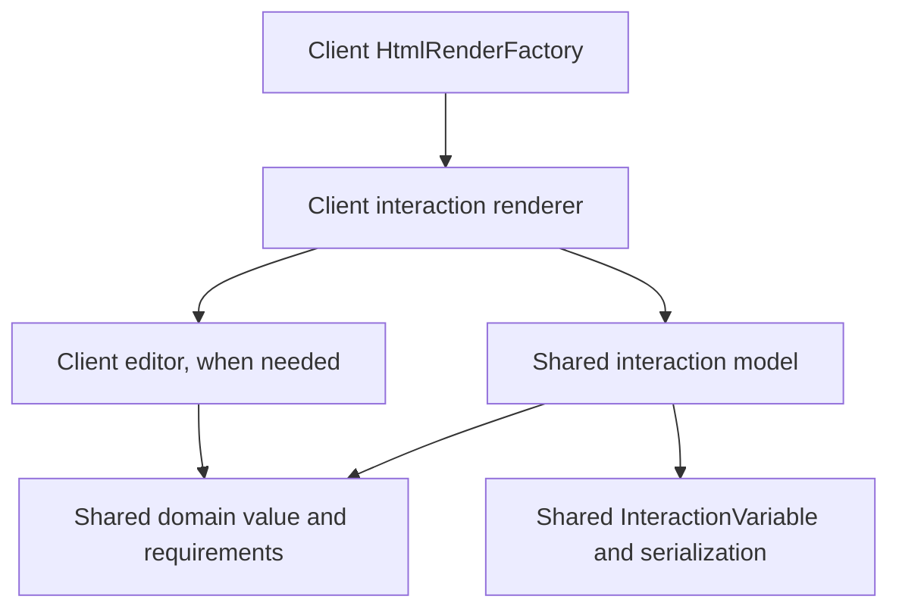

# Interaction models, renderers and editors

An interaction describes an exercise and its saved value. Its renderer connects that model to the workbook UI. An optional editor provides the controls for changing the value. The shared model is usable without a browser; renderers and editors belong to the client module.

The current trait is named **`WorkbookInteractionElement[T]`**, defined in [WorkbookElement.scala](../modules/core/shared/src/main/scala/it/evadid/workbook/abstractions/WorkbookElement.scala). “WorkbookInteraction” refers to this concept; there is no separate trait with that shorter name in the current source.

## Responsibilities and dependencies

| Component | Location | Owns | Depends on |
| --- | --- | --- | --- |
| Domain value `T` | `modules/core/shared` | Exercise data, algorithms, validation and value codecs | Shared model/utilities |
| Interaction model | `modules/core/shared` | Stable element ID, exercise configuration/requirements, default value, factory, value serializer and `InteractionVariable[T]` | Domain value and shared workbook infrastructure |
| Renderer | `modules/client` | Workbook preview/card, state binding, labels, editor construction and fullscreen opening | Interaction model, client controls, Laminar and optional editor |
| Editor | `modules/client` | Editing controls, draft/selection state, event handling and fullscreen lifecycle | Domain types, supplied bound state/configuration and browser UI infrastructure |

The source dependency direction is:



Shared interaction/domain code must not import client renderers, Laminar, DOM types or fullscreen controls. Editors can accept domain requirements and callbacks without depending on the entire workbook interaction. The QR and mail editors receive a bound `Var` and configuration; they do not look up their interaction or construct a second persistence store.

An editor is optional. A checkbox or text interaction can render its controls directly in the workbook line. A fullscreen editor is useful when the editing interface needs more space or has its own lifecycle. The renderer remains responsible for placing that interface within the workbook experience.

## Model serialization and learner state

There are two distinct serialization concerns:

- `associatedFactory` serializes the **exercise definition**: element ID, configuration, initial value and requirements. A `WorkbookElementFactory` belongs to the shared model layer.
- `serializerInteractionContent` serializes the **learner value `T`**. `InteractionVariable[T]` owns the value history and uses this serializer for persistence/synchronization.

`defaultValue` initializes the history; it is not a second live copy of the learner's answer. The current answer is `interactionVariable.currentValue`. Grading belongs to the shared domain/interaction API where possible; renderers display its result. Completion APIs are currently interaction-specific (`isPassed`, requirement evaluators, sorting results), rather than a universal grading contract on the base trait.

## Rendering and editing flow

1. A workbook factory composes interaction models into exercise containers and sections.
2. [HtmlRenderFactory.scala](../modules/client/src/main/scala/it/evadid/homepage/workbook/htmlRenderer/HtmlRenderFactory.scala) dispatches each model to its registered renderer. `LineBasedRenderingFactory` produces an `AtomarLineRendering`, wrapped with the model in `HtmlWorkbookElement`.
3. The renderer binds the interaction's value through the existing synchronization control:

   ```scala
   import it.evadid.core.datastructures.state.StateHelper.StateBasedVar
   import it.evadid.workbook.interaction.sync.UpdateImportance

   val state = element.interactionVariable
     .createBoundStateWithUpdateImportance(fullInfo.syncControl, UpdateImportance.MAJOR)
     .toAirstreamVar
   ```

4. The preview observes `state.signal`. Opening the editor passes this same bound state, together with exercise configuration, to the editor. The renderer asks `fullInfo.displayControl.setFullscreen(...)` to display it; the editor implements `HtmlAppElement` and, when necessary, `FullscreenLifecycle`.
5. Editor updates flow through the bound state into `InteractionVariable` history and `SyncControl.requestStore`. Restored/synchronized values flow back through the binding to the preview and editor. The editor should reconcile its local controls with those updates.

The binding is implemented in [InteractionVariable.scala](../modules/core/shared/src/main/scala/it/evadid/workbook/interaction/variable/InteractionVariable.scala). Editors should update the supplied state rather than bypassing it with direct local-storage writes.

Drafts, selection and validation messages are usually editor-local state. They become saved domain state only when an accepted edit updates the bound value. QR's invalid text draft preserves the last valid saved symbol; mail's unsent draft is discarded on close. Save timing and close behavior are exercise-specific and should be documented and tested.

## Concrete examples

| Layer | QR creation | Email sorting |
| --- | --- | --- |
| Domain value | `QrCode` with resolved configuration; `QrCodeRequirements` evaluates it | `InboxStateScaffolding` contains the mailbox; `InboxState.sortingResult` evaluates placement |
| Interaction | `CreateQrCodeInteraction` owns requirements and an initial code | `MailInteraction` owns initial inbox, account and `allowCompose` |
| Renderer | `CreateQrCodeInteractionRenderer` shows saved symbol/feedback and opens the editor | `HtmlMailInteractionRenderer` shows folder counts/progress and opens the editor |
| Editor | `QrCodeEditor(Var[QrCode], requirements)` | Client `MailEditor(Var[InboxStateScaffolding], account, allowCompose)` |

Read the [QR renderer](../modules/client/src/main/scala/it/evadid/homepage/workbook/htmlRenderer/interactionRenderer/qr/CreateQrCodeInteractionRenderer.scala) and [mail renderer](../modules/client/src/main/scala/it/evadid/homepage/workbook/htmlRenderer/interactionRenderer/emailSimulator/HtmlMailInteractionRenderer.scala) for the complete preview/fullscreen pattern.

**Mail naming:** there is also a shared interaction model called `MailEditor` for writing practice, distinct from the client UI editor with the same name. `HtmlMailEditorRenderer` renders that model and reuses the same client editor. The mail sorting renderer aliases the client class as `Editor` to avoid ambiguity. The name “Editor” alone does not determine which layer a class belongs to; its package and base type do.

## Adding an interaction

Define the domain value and requirements in shared core, then add the interaction model and its definition factory/content serializer. Register the factory in the shared factory registry and the renderer in `HtmlRenderFactory`. Build an editor only when the controls warrant a separate component. Keep CSS in dedicated files, reuse shared color/dimension tokens, and ensure workbook entry pages load the required styles.

Test domain transitions, validation/grading and both serialization boundaries in core JVM/JS. Test editor-local state and bindings in client tests. Browser checks should cover the actual preview/fullscreen flow, reopening/restoration, invalid drafts and layout where relevant. See the [email simulator guide](email-simulator.md) and [QR guide](qr-code-interaction.md) for existing suites and commands.
